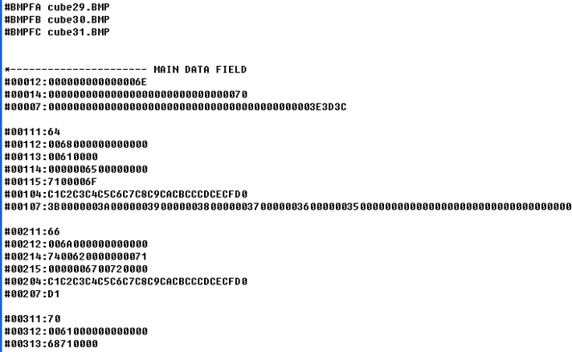

## DJ Technician

#### Rhythm game parsing BMS extension

##### BMS 파싱 기반 리듬게임

#### Made by

- NAME : 정근화 (Jung  Keunhwa)

- EMAIL : rmsghk4254@naver.com

- BLOG : https://blog.naver.com/rmsghk4254/221468117023

#### About BMS(Be-Music Script)

- [BMS Namu-wiki]([https://namu.wiki/w/Be-Music%20Script](https://namu.wiki/w/Be-Music Script))  

- [BMS Reference](https://hitkey.nekokan.dyndns.info/cmds.htm)

- .bms file example

#### About DJ Technician

- The game using extracted rhythm data parsed from .bms file
- Youtube link : https://youtu.be/kJ6VwL5-S5A

#### Environment

- Platform : Win32
- Language : c++
- Engine(F/W) : Cocos-2dx
- Sound Library : Fmod
- Video Library : OpenCV

